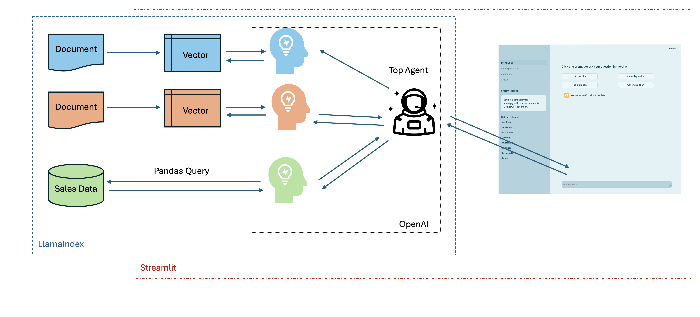
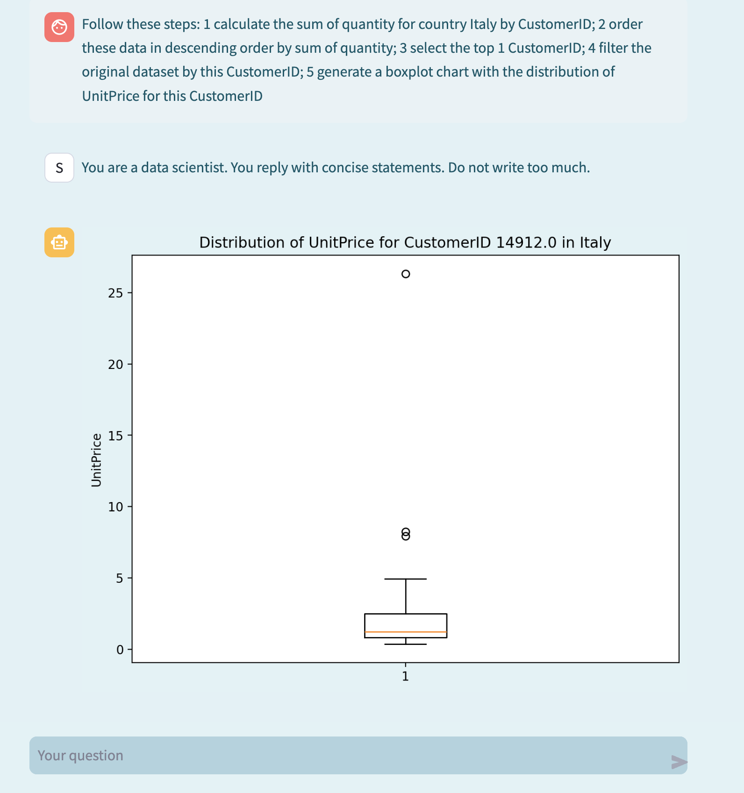
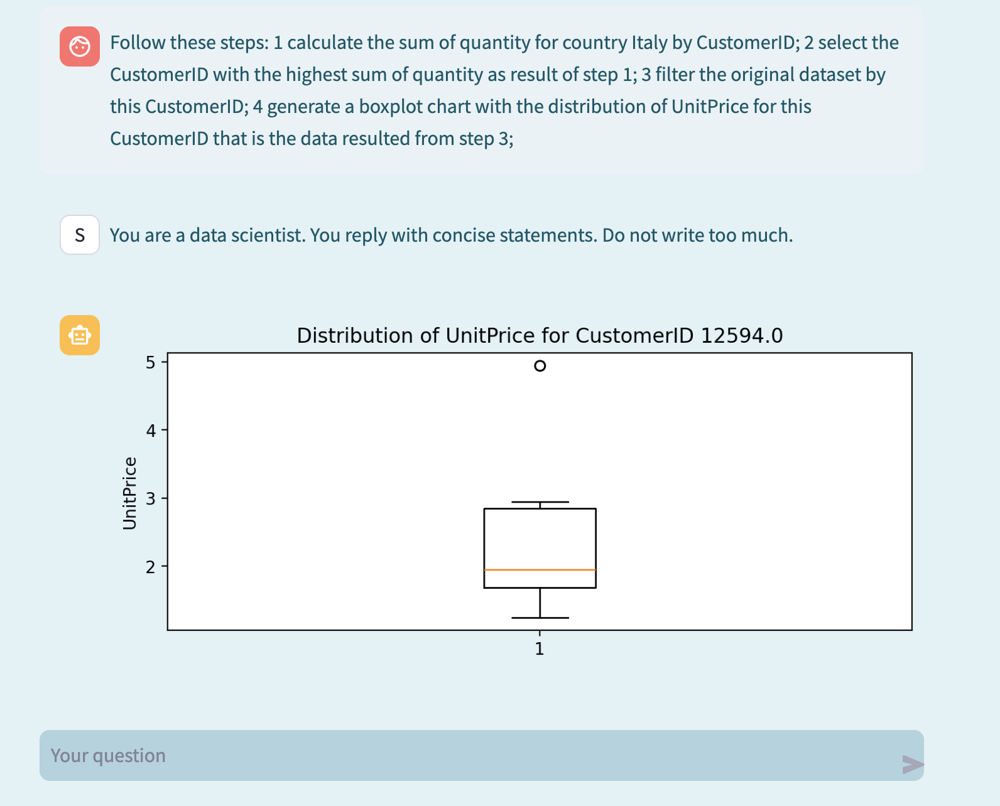

# montichat

## Concept

Montichat is a Streamlit app built with the goal of playing with Generative AI, agents and a sales dataset: in the application is possible to interact with a chatbot powered by OpenAI APIs and ask questions about features of the dataset, time series data points, aggregations. It's also possible to ask to generate charts related to the dataset.

In the same app, it's possible to check the dataset itself and the related documents. 
Below a quick screencast of the app in action:

https://github.com/lorenzobonomi/montichat/assets/13397010/04f25ef7-3728-40b4-b099-cabe382dbc73

## System

The App is built with [Streamlit](https://streamlit.io/), [OpenAI](https://openai.com/blog/openai-api) and [LlamaIndex](https://www.llamaindex.ai/) and coded entirely with Python.

Streamlit is used for the front-end: this framework offers nice and easy to use components to manage the chat conversation and to render the charts. The App can be used on the local machine and also deployed to the Streamlit cloud community environment. 

LlamaIndex is defined as a "data framework for LLM-based applications": for this project, this frameworksprovides the abstraction to augment the context for OpenAI API with multiple tools and gives the ability to ask questions about different sources of content like the dataset with the data itself or documentation like a data dictionary. The abstraction allows to ask a question about the dataset and this question is handled but a query engine tool. The query engine generates a pandas query which is then executed and the results are reported in the chat conversation. The same abstraction can redirect a question about the definition of one the dimensions available in the dataset to another tool. The tool handles the related dictionary data which has been vectorized for RAG. A top agent acts as a sort of orchestrator to leverage all the tools available.

Here's a list of useful temaples with code from Llamaindex: 
* [Multi documents agents](https://docs.llamaindex.ai/en/stable/examples/agent/multi_document_agents-v1/)
* [Pandas query engine](https://docs.llamaindex.ai/en/stable/examples/query_engine/pandas_query_engine/?h=query+engine+pandas)
* [Retrieval-Augmented agent](https://docs.llamaindex.ai/en/stable/examples/agent/openai_agent_retrieval/)

OpenAI provides the LLM model and the tools through the available APIs.

## Results

Overall, I've been positively impressed by the easiness of developing with LlamaIndex and Streamlit. In a short range of time is possible to develop a simple POC and start asking specific questions related to the sample dataset. Simple queries and questions are handled very well by the system and generating pandas queries on top of the dataframe is an interesting and simple solution at least for structured and cleaned data.

Generating charts has been a litte bit more difficult: the system works by explicitly ask for a "chart". If this keyword is mentioned in the conversation, the prompt to the API call is augmented with a specific instruction to the OpenAI model to generate matplotlib.pyplot code. Once the code is generated is augmented with an ad-hoc function. It's obviously rudimentary but yet is quite nice to ask for a chart and observe the results.

## Limits

### Questions about the data

Whenever the same predefined questions are asked, the system provides consistently the same answer. Maybe this is because of the Temperature and the Seed parameters. However, sometimes a minor change in the way the question is phrased and the system can't answer the question anymore. This could be due to the connection between the concept expressed in the the question and the specific names of the features in the dataset which is queried for Pandas.

For example the system can answer correctly the question: "Which is the month with the highest sum of quantity for United Kingdom?". And the system can also answer as a follow up question the correct year of this data point. When asked about the "month-year" with the highest sum of quantity, the system can't answer the question. 

When asked "what is the sum of quantity for Italy in November 2011?" the system replies correctly. But when asked about the quantity for Italy in November 2011, the answer is wrong. 

If we reason around the difference between the two questions, in full fairness to the system, the first question (sum of quantity) is a higher quality question because the goal is clear: aggregate by summing, the quantity for the data related to Italy, in November 2011. 

With more complex questions, the system fails at a higher rate. Asking the same question as a series of steps helps the system. For example with this question: "Follow these steps: 1 calculate the sum of quantity for country Italy by CustomerID; 2 order these data in descending order by sum of quantity; 3 select the top 1 CustomerID; 4 filter the original dataset by this CustomerID; 5 generate a boxplot chart with the distribution of UnitPrice for this CustomerID", the chatbot generates a boxplot of the UnitPrice but it fails on selecting the customer with the highest quantity.

Rephrasing the questions with a more clear flow, however helps the system in generating the right steps:

Follow these steps: 1 calculate the sum of quantity for country Italy by CustomerID; 2 select the CustomerID with the highest sum of quantity as result of step 1; 3 filter the original dataset by this CustomerID; 4 generate a boxplot chart with the distribution of UnitPrice for this CustomerID that is the data resulted from step 3;

