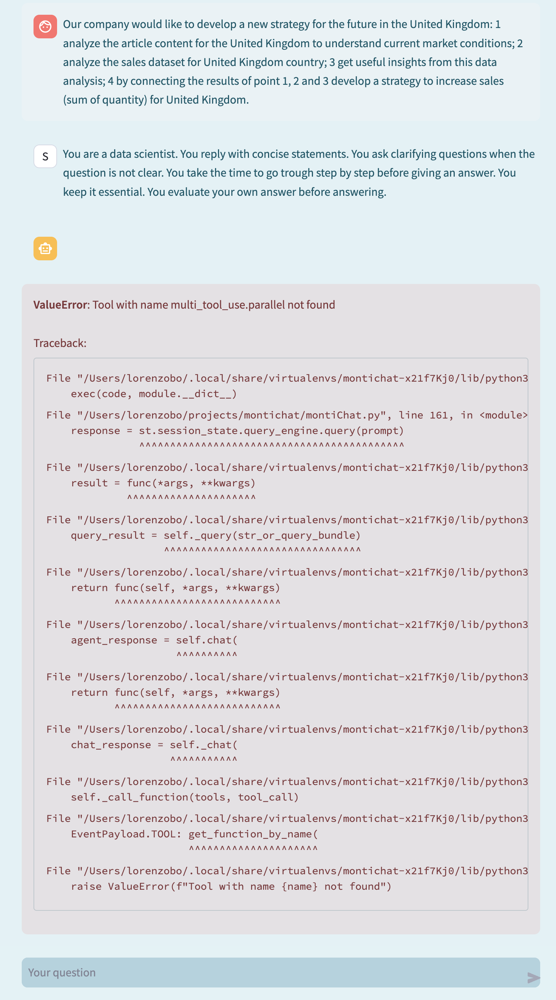
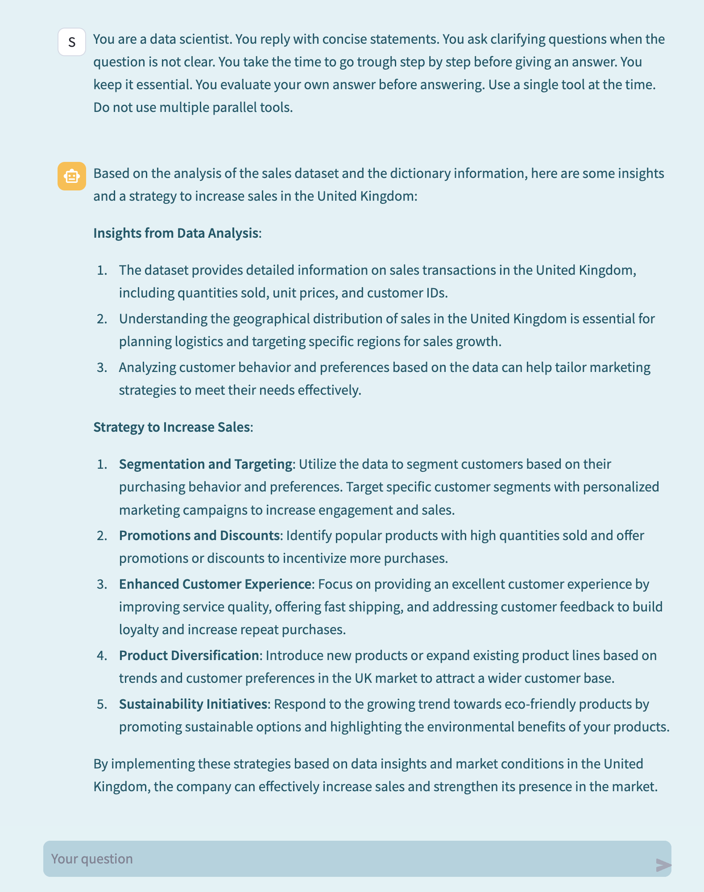

# montichat

* [Concept](#concept)
* [System](#system)
* [Results](#results)
* [Limits](#limits)
+ [Simple questions about the data](#simple-questions-about-the-data)
+ [More complex questions about the data](#more-complex-questions-about-the-data)
+ [Chart generation](#chart-generation)
* [Development](#development)

## Concept

Montichat is a Streamlit app built with the goal of playing with Generative AI, agents and a sales dataset: in the application it's possible to interact with a chatbot powered by OpenAI APIs and ask questions about features of the dataset, time series data points, aggregations. It's also possible to ask to generate charts related to the dataset.

In the same app, a data exploration section is available to double check the answers of the chatbot. 
Below a quick screencast of the app in action:

https://github.com/lorenzobonomi/montichat/assets/13397010/04f25ef7-3728-40b4-b099-cabe382dbc73

## System

The App is built with [Streamlit](https://streamlit.io/), [OpenAI](https://openai.com/blog/openai-api) and [LlamaIndex](https://www.llamaindex.ai/) and coded entirely with Python.

Streamlit is used for the front-end: this framework offers nice and easy to use components to manage the chat conversation and to render the charts. The App can be used on a local machine or can be deployed to the Streamlit cloud community environment. 

LlamaIndex is defined as a "data framework for LLM-based applications". The framework provides the abstraction to augment the context for OpenAI APIs with multiple tools. This means it's possible to ask questions about different sources of content like the sales dataset or documentation like a data dictionary. As an example, the abstraction allows to ask a question about the dataset and this question is handled by a query engine tool. The query engine generates a Pandas query which is then executed and the results are reported in the chat conversation. The same abstraction can redirect a question about the definition of one the dimensions available in the dataset to another tool. The data dictionary tool handles the dictionary document with a RAG technique. A top agent acts as a sort of orchestrator to leverage all the tools available.

Here's a list of useful templates with code from Llamaindex: 
* [Multi documents agents](https://docs.llamaindex.ai/en/stable/examples/agent/multi_document_agents-v1/)
* [Pandas query engine](https://docs.llamaindex.ai/en/stable/examples/query_engine/pandas_query_engine/?h=query+engine+pandas)
* [Retrieval-Augmented agent](https://docs.llamaindex.ai/en/stable/examples/agent/openai_agent_retrieval/)

OpenAI APIs provide the LLM model and the tools. 
Below a simple diagram related to the system:

## Results

Overall, I've been impressed by the easiness of developing with LlamaIndex, Streamlit and OpenAI. It's possible to develop a simple POC and start asking specific questions related to the sample dataset very quickly. Simple queries and questions are handled very well by the system and generating pandas queries on top of the DataFrame is an interesting and simple solution, at least for structured and cleaned datasets.

Generating is slightly more difficult: the system works by explicitly ask for a "chart". If this keyword is mentioned in the conversation, the prompt to the API call is augmented with a specific instruction to the OpenAI model to generate matplotlib.pyplot code. Once the code is generated, it's augmented with an ad-hoc function. It's an obviously rudimentary solution but yet is quite nice to ask for a chart and observe the results.

## Limits

### Simple questions about the data

Whenever the same predefined questions are asked, the system provides consistently the same answer. Maybe this is because of the Temperature and the Seed parameters. However, sometimes only a minor prompt change results in the system returning the wrong answer. T

For example, the system can answer correctly the question: "Which is the month with the highest sum of quantity for United Kingdom?". And the system can also answer as a follow up question the correct year for this data point. When asked about the "month-year" with the highest sum of quantity, the system can't answer the question anymore. Maybe this is due to the limits of the pandas query engine which can't find a month-year field or can't translate this time concept in python for Pandas DataFrames. Perhaps an additional level of abstraction with another agent could help with enriched context.

As another example, when asked "what is the sum of quantity for Italy in November 2011?" the system replies correctly. But when asked about the quantity for Italy in November 2011, the answer is wrong. 
If we reason around the difference between the two questions, in full fairness to the system, the first question (sum of quantity) is a higher quality one because the goal is clear: aggregate with a sum operation the quantity feature for the data filtered on Country equal to Italy for the date range of November 2011. Several times, this is also a problem for a human analyst answering questions: typically a good analyst should ask follow-up questions to clarify the original request. To be even more fair to both agents and human analysis, users of data should also start asking better questions... 
To overcome this limit, a better prompt could help the system adopt the same technique of a human analyst.

### More complex questions about the data

With more complex questions, the system fails at a higher rate. Asking the same question as a series of numbered steps helps the system partially overcome this limit. For example, with the question: 

"Follow these steps: 
* 1 calculate the sum of quantity for country Italy by CustomerID 
* 2 order these data in descending order by sum of quantity
* 3 select the top 1 CustomerID 
* 4 filter the original dataset by this CustomerID
* 5 generate a boxplot chart with the distribution of UnitPrice for this CustomerID"

the chatbot generates a boxplot of the UnitPrice but it fails on selecting the customer with the highest quantity.

Rephrasing the questions with a clearer flow, helps the system generating the right answer:

"Follow these steps: 
* 1 calculate the sum of quantity for country Italy by CustomerID
* 2 select the CustomerID with the highest sum of quantity as result of step 1 
* 3 filter the original dataset by this CustomerID
* 4 generate a boxplot chart with the distribution of UnitPrice for this CustomerID that is the data resulted from step 3

### Chart generation

As already wrote, chart generation is far from ideal but still working. Each chart is saved and then loaded in the conversation. As the system generates code that is then executed in the app, there's a potential prompt injection security problem which however goes beyond the limited scope of this POC.

## Development

A potential area of future development is related to leverage all the tools available and ask deeper questions to the system. For example, connecting the dots between existing sales data and documents related to the market conditions; ongoing projects; macro economical environment and so on. 

In the app, the system can analyze a mock article about market conditions in the United Kingdom. One example question is:

"Our company would like to develop a new strategy for the future in the United Kingdom:
* 1 analyze the article content for the United Kingdom to understand current market conditions 
* 2 analyze the sales dataset for United Kingdom country
* 3 get useful insights from this data analysis 
* 4 by connecting the results of point 1, 2 and 3 develop a strategy to increase sales (sum of quantity) for United Kingdom

As of April 20, 2024 there's seem to be an issue with OpenAI API [link to OpenAI community](https://community.openai.com/t/model-tries-to-call-unknown-function-multi-tool-use-parallel/490653/29) as for the screenshot below: 

Modifying the prompt seems to avoid the issue:

The answer is still not the right one as ideally we would like the system to do an analysis of the data which should be possible by generating the code and run it. Definitively a fun area of further development.

